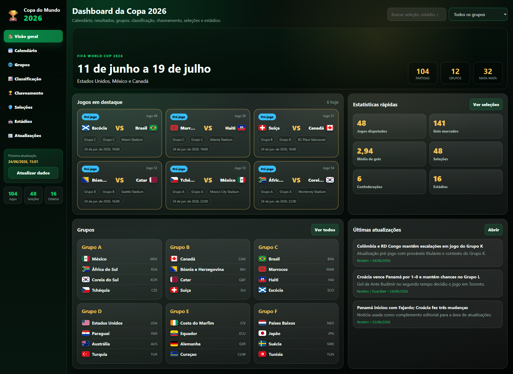
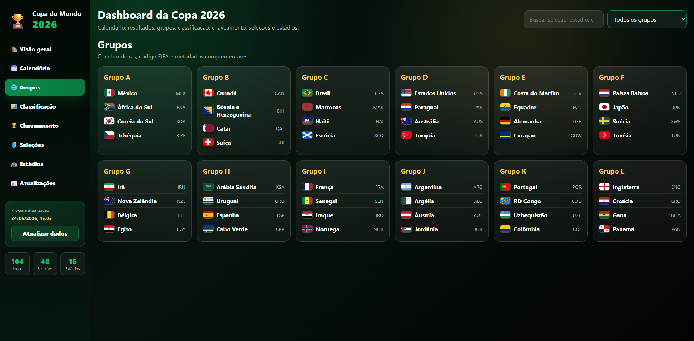
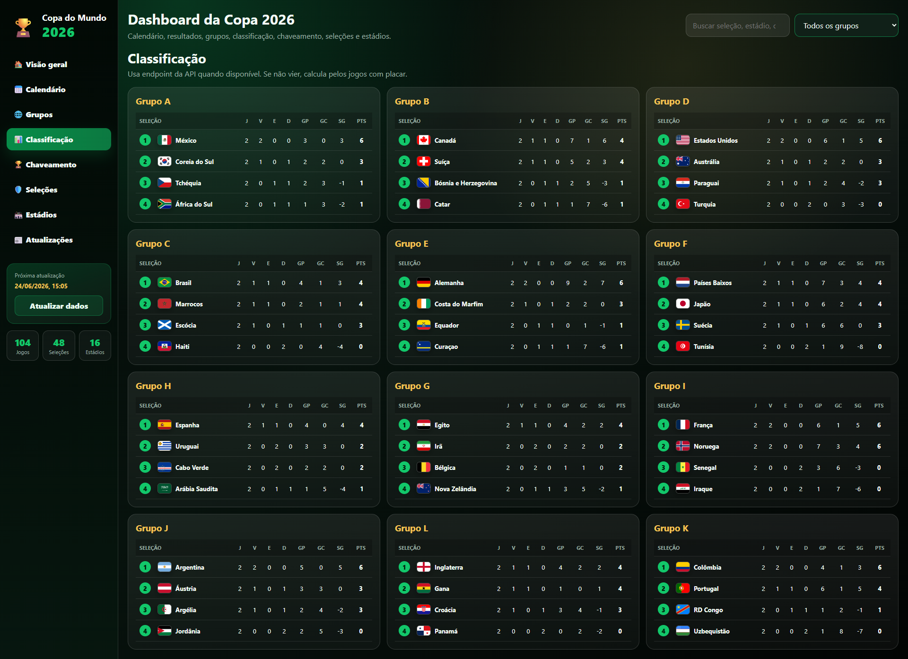
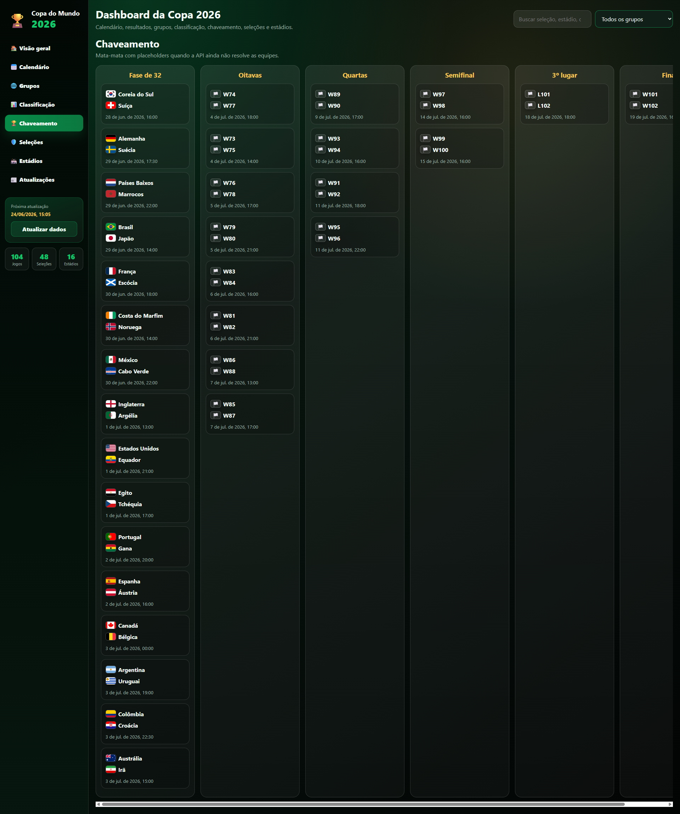
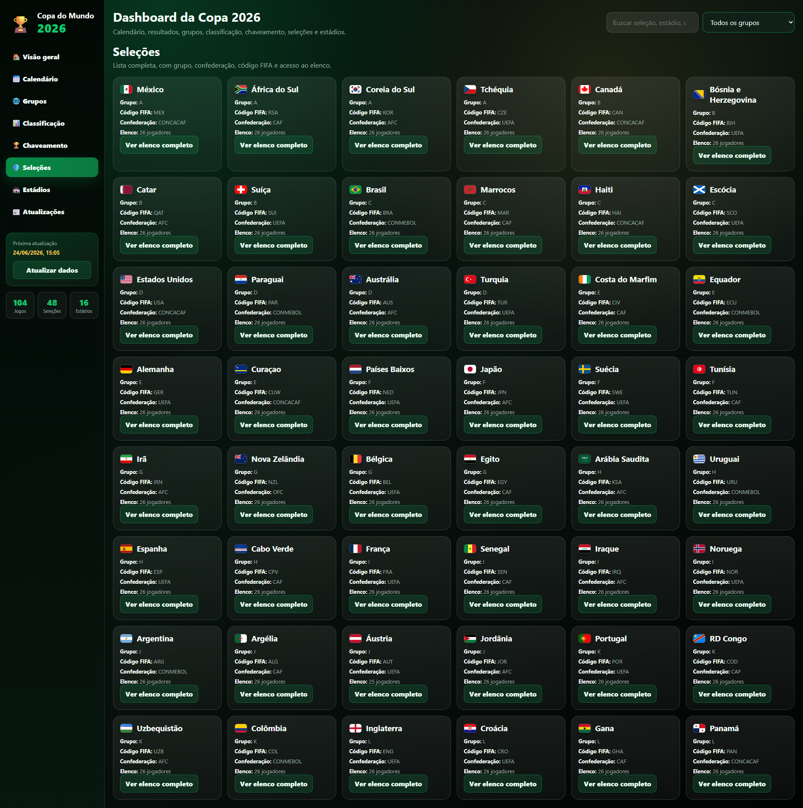
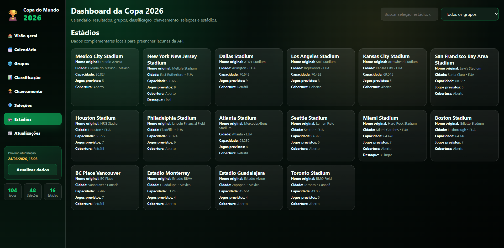
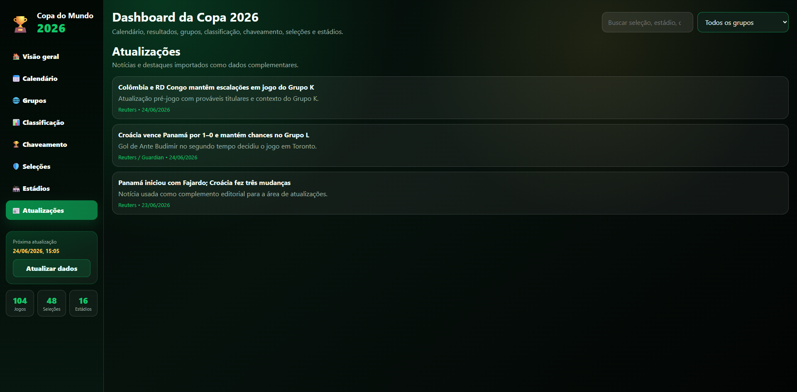

# 🏆 Copa do Mundo 2026 Dashboard

Portal interativo da Copa do Mundo FIFA 2026 desenvolvido com HTML, CSS e JavaScript, focado em desempenho, experiência do usuário e visual moderno.

O projeto reúne calendário, resultados, classificação, grupos, chaveamento, seleções participantes, elencos e informações dos estádios em uma interface inspirada em plataformas esportivas profissionais.


---

## 📸 Preview

### 🏠 Página Inicial



### 📅 Calendário de Jogos


### 🌎 Grupos



### 📊 Classificação



### 🏆 Chaveamento



### 🛡️ Seleções



### 🏟️ Estádios



### 📰 Notícias




---

## ✨ Funcionalidades

### 📅 Calendário e Resultados

* Jogos da Copa do Mundo 2026
* Destaque para partidas do dia
* Placar em tempo real (quando disponível)
* Informações detalhadas de cada partida
* Filtros por grupo e fase
* Busca global

### 🌎 Grupos

* Todos os grupos da competição
* Bandeiras das seleções
* Código FIFA
* Organização por grupo

### 📊 Classificação

* Tabelas completas por grupo
* Pontos
* Vitórias
* Empates
* Derrotas
* Saldo de gols
* Classificação automática

### 🏆 Chaveamento

* Mata-mata completo
* Oitavas de final
* Quartas de final
* Semifinais
* Disputa de terceiro lugar
* Final

### 🛡️ Seleções

* 48 seleções participantes
* Informações complementares
* Confederação
* Código FIFA
* Elencos completos

### 👥 Elencos

* Jogadores organizados por posição
* Goleiros
* Defensores
* Meio-campistas
* Atacantes

### 🏟️ Estádios

* Estádios oficiais da Copa 2026
* Cidade sede
* Capacidade
* Quantidade de partidas
* Informações complementares

### 📰 Atualizações

* Área para notícias e destaques
* Informações complementares sobre a competição

---

## 🚀 Tecnologias Utilizadas

### Front-end

* HTML5
* CSS3
* JavaScript (Vanilla)

### APIs

* Zafronix FIFA World Cup API
* Dados complementares locais

### Recursos Visuais

* FlagCDN
* Layout responsivo
* Tema Dark

---

## 🎨 Características da Interface

* Interface Dark moderna
* Design responsivo
* Navegação lateral
* Cartões interativos
* Bandeiras das seleções
* Animações suaves
* Experiência otimizada para desktop e mobile

---

## 📂 Estrutura do Projeto

```text
copa-2026-dashboard/
│
├── index.html
├── style.css
├── app.js
│
├── assets/
│   ├── images/
│   ├── icons/
│   └── screenshots/
│
├── tools/
│   └── update_squads.py
│
└── README.md
```

---

## ⚙️ Instalação

Clone o repositório:

```bash
git clone https://github.com/SEU-USUARIO/copa-2026-dashboard.git
```

Entre na pasta:

```bash
cd copa-2026-dashboard
```

Abra o arquivo:

```text
index.html
```

ou utilize uma extensão como Live Server.

---

## 🔑 Configuração da API

No arquivo:

```javascript
app.js
```

Configure sua chave:

```javascript
const API_KEY = "SUA_CHAVE";
```

---

## 📈 Melhorias Futuras

* [ ] Simulador da Copa
* [ ] Ranking FIFA
* [ ] Artilharia
* [ ] Assistências
* [ ] Estatísticas avançadas
* [ ] Heatmaps
* [ ] Comparação entre seleções
* [ ] Previsão de partidas com IA
* [ ] PWA (Aplicativo Instalável)
* [ ] Notificações em tempo real
* [ ] SEO avançado
* [ ] Integração com Google Analytics

---

## 🌐 Deploy

O projeto pode ser publicado em:

* GitHub Pages
* Cloudflare Pages
* Netlify
* Vercel

---

## 📄 Licença

Este projeto foi desenvolvido para fins educacionais, demonstração técnica e estudo de desenvolvimento web.

---

## 👨‍💻 Autor

**Anderson Moegel**

Desenvolvedor de Sistemas | Automação | IA | Dashboards | APIs

GitHub:
https://github.com/andersonmoegel

LinkedIn:
https://www.linkedin.com/in/andersonmoegel

---

⭐ Se este projeto foi útil para você, considere deixar uma estrela no repositório.
